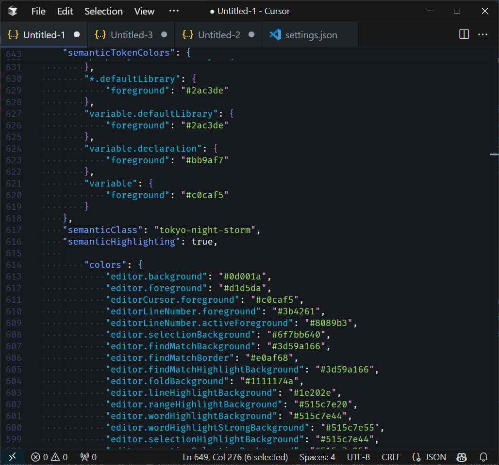

# Indique – A VS Code Color Theme

Indique is a personalized Visual Studio Code color theme featuring custom Git highlighting colors, optimized for visibility and eye comfort across devices and dark mode environments.

<div style="display: flex; flex-direction: column; gap: 20px widht=700px; height:auto">
  
  
  
  
</div>

## Table of Contents

- [Features](#features)
- [Installation](#installation)
  - [Manual Installation](#manual-installation)
- [Theme Activation](#theme-activation)
- [Customization](#customization)
- [Building from Source](#building-from-source)
- [Contributing](#contributing)
- [License](#license)

## Features

- **Custom Git Status Indicators**: Light-colored accents for added, modified, and other Git statuses.
- **Optimized for Eye Comfort**: Colors designed for reduced strain during long coding sessions.
- **Consistent in Dark Mode**: Perfectly suited for dark environments.
- **Simple Installation and Updates**: Easy manual installation instructions.

## Installation

### Marketplace Installation (Recommended)

1. Open VS Code
2. Go to Extensions (`Ctrl/Cmd+Shift+X`)
3. Search for **"Indique Theme"**
4. Click **Install**

### Manual Installation

1. **Clone the Repository**  
   Open your terminal and run:

   ```bash
   git clone https://github.com/IDNQ/indique-theme.git
   cd indique-theme
   ```

2. **Copy the Theme to VS Code Extensions**
   - **Linux/macOS**:
     ```bash
     cp -r indique-theme ~/.vscode/extensions/
     ```
   - **Windows (PowerShell)**:
     ```powershell
     Copy-Item -Path indique-theme -Destination "$env:USERPROFILE\.vscode\extensions\" -Recurse
     ```

## Theme Activation

1. Restart VS Code.
2. Open the Command Palette with `Ctrl/Cmd + Shift + P`.
3. Search for **"Preferences: Color Theme"** and select it.
4. Choose **"Indique"** from the dropdown list.

## Customization

1. Edit the theme file at `themes/indique.json`.  
   Example customization:
   ```json
   {
     "gitDecoration.addedResourceForeground": "#e6ffe6",
     "gitDecoration.modifiedResourceForeground": "#ffffe6"
   }
   ```
2. Save your changes and re-copy the theme folder to your VS Code extensions directory.
3. Reload VS Code with `Ctrl/Cmd + Shift + P` → **"Developer: Reload Window"**.

## Building from Source

No additional build steps are required. Simply clone the repository and copy the theme folder as described in the [Installation](#installation) steps.

## Contributing

1. Fork the repository.
2. Create a feature branch:
   ```bash
   git checkout -b feature/improvement
   ```
3. Commit your changes:
   ```bash
   git commit -m "Add color tweaks"
   ```
4. Push to your branch:
   ```bash
   git push origin feature/improvement
   ```
5. Open a Pull Request detailing your changes.

## License

MIT © IDNQ  
See [LICENSE](LICENSE) for details.

Enjoy coding with Indique! 🎨
Give it a ⭐ on GitHub if you find it useful!
